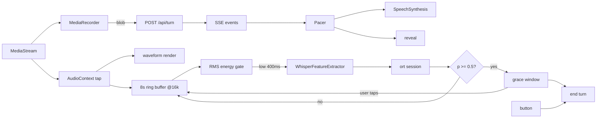
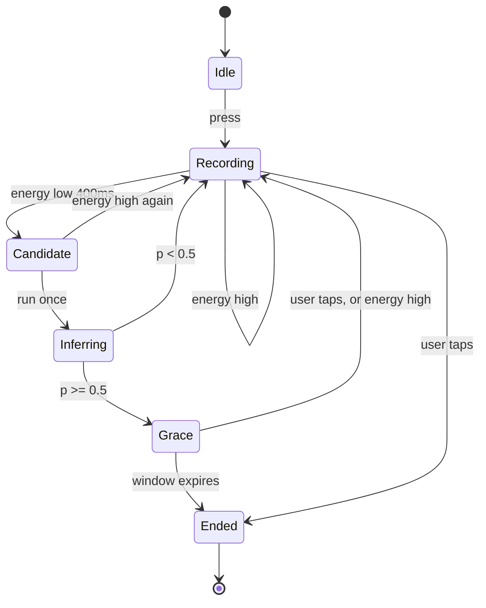
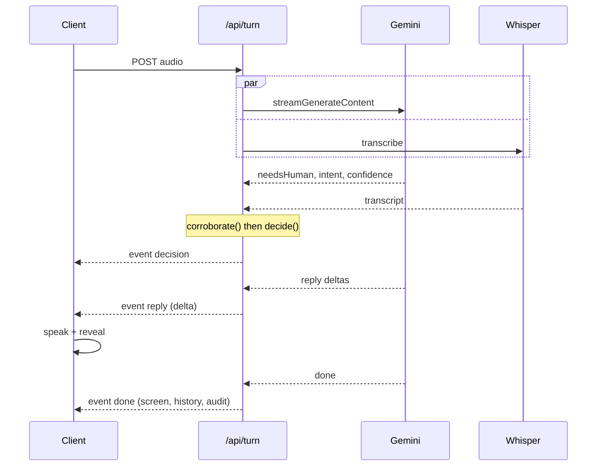

# Spec A — the feel layer

The turn loop works and does not feel like it works. This spec covers four changes to
how a turn *behaves* over time. It changes no policy, no threshold and no intent.

Spec B (guided procedures: cursor state, knowledge cards, step graph) is deliberately
not here. It is specced after this ships, because its central mechanic — pause at a step
and wait for the user to confirm — is turn-taking, and building it on a turn loop that
stutters means debugging two layers at once.

## What changes

| Area | Today | After |
|---|---|---|
| Ending a turn | Button only | Button, plus semantic auto-end where the language is covered |
| While recording | Live caption from `SpeechRecognition` | Amplitude waveform. No caption |
| Reply arrival | One JSON, whole reply appears at once | SSE, spoken and revealed as it generates |
| Reply reveal | Instant, unrelated to the voice | Word-by-word, driven by TTS boundary events |
| `Understanding.language` | One enum value | `languages: Language[]`, primary first |
| Transcriber language | Declared, hardcoded `null` | Wired through to the audit record |
| Components | Raw Tailwind classes | shadcn primitives, rethemed onto existing tokens |

## Decisions, with what was rejected

| Decision | Chosen | Rejected | Why |
|---|---|---|---|
| End-of-turn model | `pipecat-ai/smart-turn-v3` int8 ONNX | `livekit/turn-detector` | LiveKit's reads a transcript. This codebase's founding claim is that the transcript is unreliable for these speakers (46% WER Hokkien). Smart Turn reads the waveform |
| Runtime | `onnxruntime-web` direct | transformers.js `AutoModel` | Measured: transformers.js cannot load it. `AutoModel` hunts for a nonexistent `encoder_model_int8.onnx`; `AutoModelForAudioClassification` returns `Unsupported model type: whisper` |
| Mel extraction | transformers.js `AutoProcessor` only | Hand-rolled FFT + mel | 0.15 MB over the wire for a correct `WhisperFeatureExtractor` that already carries this model's `chunk_length: 8`. Hand-rolling buys 0.15 MB and risks silent feature mismatch |
| Speech gate | RMS energy | Silero VAD (`@ricky0123/vad-web`) | 2.33 MB to decide *when to run* a model that is itself the decision-maker. A false trigger costs one inference |
| Model hosting | Self-hosted static asset | Hugging Face CDN | Same-origin (no CORP question under COEP), on Cloudflare's edge, and no third-party uptime in the path of an elderly user pressing a button |
| Streaming | SSE from `/api/turn` | Client-side reveal only | Speech starts before generation finishes. Worth ~300–600 ms of a ~1800 ms turn |
| Ordering safety | `propertyOrdering` on the response schema | Speak-then-retract | Gemini 2.5+ honours schema key order, so `confidence` lands before `reply`. Nothing is ever spoken before the policy has run |
| Component base | shadcn primitives, rethemed | shadcn defaults; or no library | Radix accessibility and the composition model are worth having before spec B's cards. The default aesthetic is not — `global.css` forbids borders and dividers |

## Measured evidence

Chrome, Windows desktop, 16 cores, `onnxruntime-web@1.29.0`, `@huggingface/transformers@4.2.0`,
`onnx-community/smart-turn-v3-ONNX`. Throwaway probe, since deleted.

### Model metadata, read from the live session

```
inputs:  ["input_features"]
outputs: ["logits"]
inputMetadata: [{"name":"input_features","isTensor":true,"type":"float32","shape":["s6",80,800]}]
feature extractor config: {"chunk_length":8,"dither":0,"feature_extractor_type":"WhisperFeatureExtractor",
"feature_size":80,"hop_length":160,"n_fft":400,"n_samples":128000,"nb_max_frames":800,
"padding_side":"right","padding_value":0,"return_attention_mask":false,"sampling_rate":16000, ...}
```

### End to end, mel through to probability

```
[silence] mel 803.4ms key=input_features dims=[1,80,800]
  logit=3.5446 p(end_of_turn)=0.9719
[noise then 2s silence] mel 60.0ms key=input_features dims=[1,80,800]
  logit=3.3326 p(end_of_turn)=0.9655
```

### Inference, not cross-origin isolated

```
threads=1
session created in 1476ms
inference ms (5 runs): 242.9, 245.5, 222.3, 222.0, 210.8
```

### Inference, cross-origin isolated (COEP credentialless)

```
isolated=true cores=16
threads=4
session created in 1412ms
inference ms (5 runs): 93.8, 98.1, 95.2, 98.0, 95.0
```

### Transfer sizes

```
   2.86 MB transfer |   13.32 MB decoded | onnxruntime-web@1.29.0/dist/ort-wasm-simd-threaded.wasm
   0.02 MB transfer |    0.05 MB decoded | onnxruntime-web@1.29.0/dist/ort.wasm.min.mjs
   0.01 MB transfer |    0.02 MB decoded | onnxruntime-web@1.29.0/dist/ort-wasm-simd-threaded.mjs
   0.15 MB transfer |    0.53 MB decoded | @huggingface/transformers@4.2.0
TOTAL DECODED (combo page): 36.44 MB
```

```
$ curl -sIL .../onnx/model_int8.onnx   | grep content-length
content-length: 8575793
$ curl -sIL .../onnx/model_q4f16.onnx  | grep content-length
content-length: 5712765
```

Served without `content-encoding`, so 8,575,793 bytes is the wire size.

**Budget: ~11.5 MB transfer, ~36 MB resident.**

### What this rules in or out

**Rules out:** the 12 ms inference figure from the vendor blog as anything to design
against in a browser. Measured 95 ms isolated and 222 ms not, on a 16-core desktop.

**Rules out:** running detection in a polling loop. At 95–222 ms on a desktop, an old
Android is plausibly 0.5–1.5 s per call.

**Rules in:** one inference per silence candidate, inside a grace window that is already
seconds long. That fits comfortably.

**Rules in:** ~11.5 MB total, well under the 15 MB ceiling that would have made the
connection gate the common path rather than the exception.

**Does not establish:** anything whatsoever about accuracy. Both probe inputs scored
p≈0.97, and neither was speech. This proves the plumbing runs. It says nothing about
whether the model is right, and nothing about the four target languages it does not
cover.

## Architecture



## 1. Turn-end detection

New file `src/lib/turn-detect.ts`.

### Arming

Auto-end is armed only when **every** condition holds. Any failure is silent and lands
on today's button-only behaviour.

| Gate | Rule | Reason |
|---|---|---|
| Turn number | Never on turn 1 | The language is unknown until a turn has completed |
| Language | Every entry in `languages` is in `SMART_TURN_LANGS` | The model covers 23 languages. `ms`, `ta`, `nan`, `yue` are not among them |
| Connection | Not `saveData`, not `2g`/`slow-2g`/`3g` | ~11.5 MB on a metered plan, for this audience |
| Load | Model, runtime and processor all resolved | Any fetch failure disarms permanently for the session |

`SMART_TURN_LANGS` covers the model's 23: Arabic, Bengali, Chinese, Danish, Dutch,
German, English, Finnish, French, Hindi, Indonesian, Italian, Japanese, Korean, Marathi,
Norwegian, Polish, Portuguese, Russian, Spanish, Turkish, Ukrainian, Vietnamese.

Mapped onto this codebase's `Language` enum:

| `Language` | Armed | Note |
|---|---|---|
| `en` | yes | 94.7% reported |
| `sg` | yes | Singlish maps to English |
| `zh` | yes | "Chinese" is Mandarin |
| `ms` | **no** | Indonesian is not assumed to transfer |
| `ta` | **no** | Dravidian; no Indic proxy assumed |
| `nan` | **no** | Hokkien absent |
| `yue` | **no** | Cantonese absent |
| `unknown` | **no** | Cannot verify coverage |

Code-switching: `['en','zh']` arms. `['en','ta']` does not. The rule is `every`, not
`some` — a mixed utterance is only as safe as its least-covered language.

### Lifecycle



The critical edge is `Grace --> Recording`. The grace window is not a countdown to being
cut off; it is an offer the user can decline by speaking or by tapping. Speaking again
cancels it silently, with no penalty and no message.

### Constraints

Constants, in one place so they can be retuned rather than hunted for, the way
`THRESHOLDS` already is in `policy.ts`:

| Constant | Value | Meaning |
|---|---|---|
| `SILENCE_RMS` | 0.015 | Below this counts as not speaking |
| `SILENCE_MS` | 400 | How long energy must stay low before one inference runs |
| `END_OF_TURN_P` | 0.5 | Model card's own threshold. `sigmoid(logit) >= 0.5` |
| `GRACE_MS` | 1500 | How long the offer stands before the turn ends |

`GRACE_MS` is deliberately long. It is the whole safety margin for a population that
pauses mid-sentence, and it is the first number to raise if anyone is cut off.

- **One inference per candidate.** Never a polling loop. Enforced by a `pending` flag.
- The 8-second window is the **tail** of the ring buffer, left-padded with zeros when
  shorter, per the model card.
- `AudioWorklet` where available, `ScriptProcessor` where not. Failure of both disables
  the waveform and detection together and shows the listening indicator instead.
- Session creation measured at ~1.4 s, so it happens during idle after turn 1, never
  inside a turn.

### Cross-origin isolation

`COOP: same-origin` and `COEP: credentialless` on the document response, set in Astro
middleware (`src/middleware.ts`) rather than `public/_headers`, because `output: 'server'`
means the document is generated per request and `_headers` only covers static assets.
`credentialless` rather than `require-corp` so that a subresource without its own CORP
header does not hard-fail.

Measured 2.4x (222 ms → 95 ms). Nearly free here because suara loads no third-party
subresources — the same no-webfont decision `global.css` documents. Self-hosting the
model keeps it that way.

## 2. Streaming the reply

`RESPONSE_SCHEMA` in `src/lib/providers/prompt.ts` gains:

```
propertyOrdering: ['needsHuman', 'intent', 'confidence', 'languages', 'slots', 'reply']
```

Everything the policy consumes arrives before the first word of the reply.

**Gotcha, documented by Google:** any example or description in the prompt must use the
same ordering as the schema or the model degrades. `systemPrompt()` has a numbered rule
list whose order currently differs; it gets reordered to match in the same change.



`runTurn` becomes `runTurnStream(req, provider, transcriber): AsyncGenerator<TurnEvent>`.
`runTurn` stays as a thin wrapper that drains the generator and returns the final
`TurnResponse`, so `turn.test.ts` keeps testing turn logic through the same entry point
rather than being rewritten around a generator. Those tests still need the
`language` → `languages` rename from section 4; the wrapper keeps that to a rename and
nothing more.

```ts
export type TurnEvent =
  | { t: 'decision'; kind: Decision['kind']; intent?: Intent }
  | { t: 'reply'; delta: string }
  | { t: 'done'; response: TurnResponse }
  | { t: 'error' };
```

**The decision needs both channels.** `decide()` runs on the *corroborated* confidence,
which needs Whisper's transcript as well as Gemini's head fields. If the transcript has
not landed when reply deltas start, deltas **buffer and are not spoken**. Worst case is
exactly today's behaviour. Nothing is spoken before the policy has run — that invariant
is unchanged and is what makes streaming safe here.

## 3. Pace and TTS sync

New file `src/lib/pace.ts`.

**You cannot append to an in-flight `SpeechSynthesisUtterance`.** So deltas accumulate
and flush a queued utterance at each sentence boundary. Replies are capped at 400
characters, so there is at most one seam.

| Problem | Fix |
|---|---|
| Text appears before it is spoken | `utterance.onboundary` reveals word by word, in step with the voice |
| Safari's `onboundary` is unreliable | Fall back to constant-rate derived from `u.rate` and character count |
| Bursty arrival | Buffer and release at a constant rate. Never a randomised jitter — that reads as instability, not life |
| Reply starts the instant it can | A fixed 300 ms lead-in beat before speech begins. Considered, not canned. This is the one place a deliberate delay helps |
| The user already struggled once | Session pace multiplier: after any `repeat` decision, everything slows. It never speeds back up within a session |

## 4. Language and code-switching

`Understanding.language: Language` becomes `languages: Language[]`, primary first,
min 1, max 3.

Touches `understanding.ts`, `prompt.ts` (`RESPONSE_SCHEMA` and rule 6), `gemini.ts`,
`fake.ts`, `turn.ts` (`TurnResponse.language`), `Voice.tsx` (`VOICE_LANG` lookup uses
`languages[0]`). No persistence exists, so there is no migration.

`TranscriptResult.language` is declared on the interface and hardcoded `null` in both
real transcribers (`transcript.ts:68`, `:150`). Wire it through and add it to
`TurnAudit`. A language disagreement between channels is recorded as evidence, exactly
as an intent disagreement already is in `corroborate.ts`. It does **not** adjust
confidence in this spec — recording first, acting on it later once there is data.

**Out of scope, still broken:** `VOICE_LANG` maps `nan → zh-TW` and `yue → zh-HK`, so a
Hokkien speaker is answered in Mandarin. That is the README's documented largest gap and
is not fixed here.

## 5. UI

### shadcn adoption

Init for Astro with Tailwind v4, `cssVariables: true`. The point is Radix's
accessibility work and the composition model before spec B needs cards — not the
default look.

**Retheme, do not adopt.** shadcn's defaults contradict this codebase's stated design
rules. Mapping:

| shadcn token | Bound to | Note |
|---|---|---|
| `--background` | `var(--paper)` | |
| `--foreground` | `var(--ink)` | |
| `--muted-foreground` | `var(--quiet)` | |
| `--primary` | `var(--speak)` | |
| `--destructive` | `var(--live)` | Only ever while the mic is open |
| `--border` | `transparent` | `global.css`: structure is size and space, never rules |
| `--radius` | `0.75rem` | Matches `.tap` |

Component font sizes are overridden to the existing `--text-*` scale. A shadcn `Button`
at its default 14px is unreadable for this audience; `.tap` stays 72px minimum and
full width.

Installed in this spec: `button`, `progress`. Nothing else. Cards and the flow graph
belong to spec B and are not installed early.

### New states

| State | Shows |
|---|---|
| Recording | Waveform driven by the same `AudioContext` tap. No caption |
| Grace window | "I think you're done — tap if you're not finished" plus a `Progress` bar draining over the window. Tapping or speaking cancels it |
| Waiting | Waveform stills to a low idle pulse. Button reads "One moment" |
| Replying | Reply text revealing word by word in step with the voice |

The waveform replaces the caption because Chrome's recogniser has no Hokkien and no
Teochew — those users currently watch their speech transcribed into wrong English.
A waveform answers "is it listening?" and cannot be wrong.

## Files

| File | Change |
|---|---|
| `src/lib/turn-detect.ts` | new — arming gates, energy gate, ring buffer, inference |
| `src/lib/pace.ts` | new — sentence chunking, constant-rate release, pace multiplier |
| `src/lib/audio.ts` | new — `AudioContext` tap, resample to 16k, RMS, waveform samples |
| `src/lib/turn.ts` | `runTurnStream` generator; `runTurn` becomes a wrapper |
| `src/pages/api/turn.ts` | SSE response |
| `src/lib/understanding.ts` | `languages: Language[]` |
| `src/lib/providers/prompt.ts` | `propertyOrdering`; reorder rule list to match |
| `src/lib/providers/transcript.ts` | return detected language |
| `src/lib/caption.ts` | **deleted** — captions removed from the recording path |
| `src/lib/caption.test.ts` | **deleted** with it |
| `src/middleware.ts` | new — COOP/COEP response headers |
| `src/components/Voice.tsx` | SSE client, waveform, grace window, streamed reveal |
| `src/components/ui/*` | shadcn `button`, `progress` |
| `src/styles/global.css` | shadcn token bindings |
| `astro.config.mjs` | unchanged; headers live in middleware |
| `public/models/smart-turn-v3-int8.onnx` | self-hosted, 8,575,793 bytes |

## Testing

Pure logic behind a thin browser shim, the same seam `caption.ts` used with its exported
`mergeResults`.

| Unit | Asserts |
|---|---|
| `armable()` | Refuses `['en','ta']`, allows `['en','zh']`, refuses turn 1, refuses `saveData` |
| `tailWindow()` | Left-pads a 3 s buffer to 128,000 samples with the audio at the end |
| Energy gate | 400 ms low → one candidate, not many. Re-arms after speech resumes |
| Grace state machine | Speech during grace cancels and returns to Recording with no penalty |
| `sentenceChunks()` | Splits on boundaries, holds a partial sentence back |
| `paceMultiplier()` | Slows after `repeat`, never speeds back up |
| `runTurnStream()` | Emits `decision` before any `reply`; buffers deltas when the transcript is late |
| Degradation | Model fetch failure, unsupported language, no `AudioWorklet`, SSE failure — every one lands on button-only with nothing shown to the user |

`FakeProvider` and `FakeTranscriber` must drive all of it. Anything that cannot be driven
by the fakes has a vendor assumption baked in, per the README.

Full gate: `npm run verify`.

## Degradation matrix

Every row must land somewhere a user can act. No dead ends.

| Failure | Result | Visible to user |
|---|---|---|
| Model fetch fails | Button-only for the session | Nothing |
| Language not covered | Button-only, permanently | Nothing |
| Metered or slow connection | Model never fetched | Nothing |
| No `AudioWorklet` or `ScriptProcessor` | No waveform, no detection | Listening indicator instead of waveform |
| `onboundary` unsupported | Constant-rate reveal | Nothing |
| SSE unsupported or fails | Falls back to a single JSON POST | Nothing |
| Turn fails entirely | Existing `repeat` screen | One spoken instruction, as today |

## Open questions

| # | Question | Assumption I will make | Cost if wrong |
|---|---|---|---|
| 1 | Is Smart Turn accurate on Singlish and Singapore-accented English? Unmeasured; the probe established nothing about accuracy | It is adequate at threshold 0.5, with the grace window absorbing errors | Users cut off mid-thought, or auto-end never fires. The button always works, so the floor is today's behaviour |
| 2 | Inference on a real old Android — 0.5 s or 1.5 s? Measured only on a 16-core desktop | Acceptable, because it runs once per pause inside a multi-second window | If it is over ~2 s the grace window feels broken and detection should be disabled below some `hardwareConcurrency` |
| 3 | Does `@cf/openai/whisper` return a detected language at all? | It does not — move to `whisper-large-v3-turbo`, which returns `transcription_info.language` | Section 4's cross-channel language check is unbuildable; falls back to Gemini's self-report alone |
| 4 | Does `model_q4f16` (5,712,765 bytes) hold accuracy against `model_int8` (8,575,793)? | Ship `int8`; treat `q4f16` as a size lever to test later | 2.9 MB left on the table, or a worse detector shipped |

**Questions 1 and 2 are the ones that change the work.** Both are measurement tasks, both
need real speech from real speakers, and neither can be answered from a desk. 3 and 4
have safe defaults.

Carried per `kb-open-questions`: these are guesses, not confirmations. Approval of this
spec is not an answer to them.
