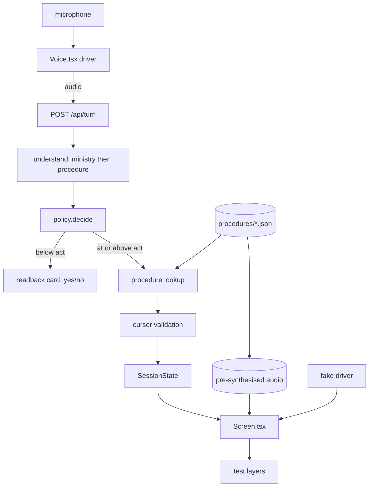
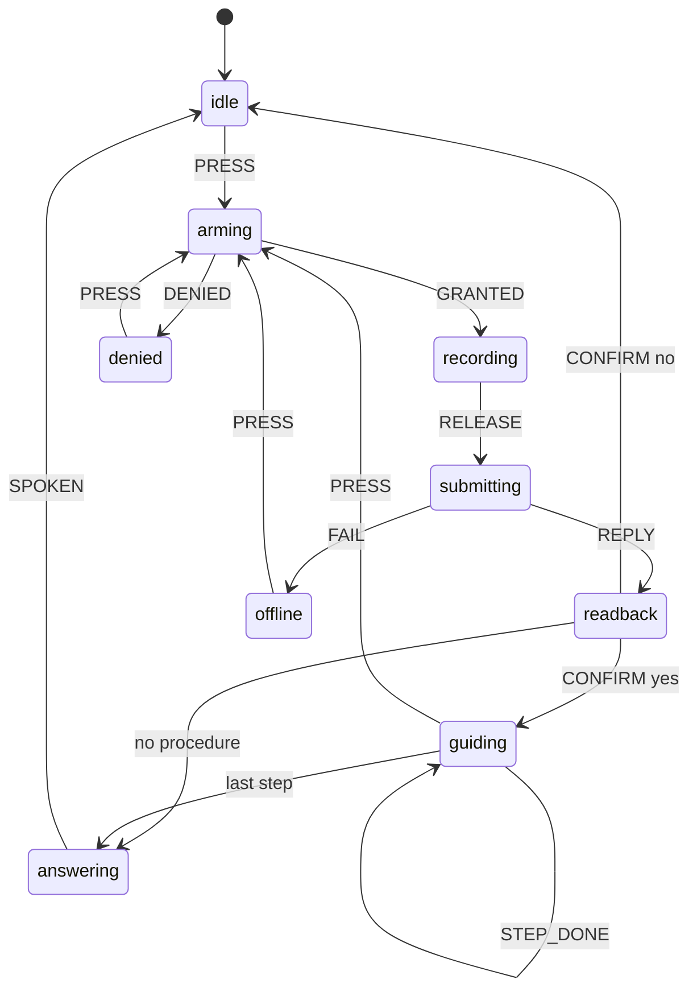

# Spec B — guided procedures

The product answers a question and stops. It should walk someone to the end of a task.

"I want to check my CPF statement" is not a request for a fact. It is a request to be
taken through four screens on a website the person cannot navigate. Today the system
classifies that into `silver_support` or `human_handoff`, says one sentence, and ends the
turn. The user is exactly where they started.

This spec changes the turn loop from a classifier into a step advancer, and adds the
knowledge base the steps come from.

## What this supersedes

Spec A (`2026-09-08-feel-layer-design.md`) is partly withdrawn by this document. It was
written on the assumption that a reply should be streamed and revealed as it generates.
That is now rejected.

| Spec A section | Status | Why |
|---|---|---|
| 1. Turn-end detection | **Stands** | Unaffected. Smart Turn still governs when a turn ends |
| 2. Waveform while recording | **Stands** | Unaffected |
| 3. SSE streaming from `/api/turn` | **Withdrawn** | See below |
| 4. Word-by-word reveal from TTS boundaries | **Withdrawn** | See below |
| 5. `languages: Language[]` | **Stands** | Still wanted, unrelated to streaming |
| 6. shadcn primitives | **Deferred** | Not needed for this spec; revisit at Spec C |

Streaming commits pixels and speech to an understanding that may still be wrong.
Retracting a spoken sentence is worse for this population than making them wait — a
system that says something and takes it back reads as unreliable in a way that a system
which pauses does not. The wait is real and still needs solving; this spec solves it with
the readback card (§6) rather than with token streaming.

Spec A's own sequencing argument said B must not be built on a stuttering turn loop.
That argument still holds, and it is why §1 of this spec is a test seam rather than a
feature: the seam is what makes both specs safe to land.

## What changes

| Area | Today | After |
|---|---|---|
| Unit of knowledge | Six intents, five screens | N procedures, each a step graph |
| End of a turn | One sentence, terminal | A step, with the next one waiting |
| Facts | `factsFor(intent)`, always empty | Authored steps, gated on `verified` |
| Confirmation | Once, on low confidence | Once for understanding, then once per step for progress |
| What the user sees while thinking | "One moment" | Nothing, then a readback card |
| Client state | `recording` and `busy` booleans | An explicit `SessionState` union |
| UI testability | None. Needs a microphone and a paid call | Every state renderable from a plain object |
| Speech | On-device, every string | Pre-synthesised for authored text, on-device for dynamic |
| Images | None | Optional per step, with a staleness gate |

## Decisions, with what was rejected

| Decision | Chosen | Rejected | Why |
|---|---|---|---|
| Reply delivery | Render only after the decision is made | SSE token streaming (Spec A) | A retracted sentence costs more than a pause, for this audience |
| Filling the wait | Readback card, then the stepper | Spinner; token streaming | Semantic progressive rendering. The card is also the confirmation surface, so it does two jobs |
| Procedure selection | Classification from audio, full index in the prompt | Vector retrieval over the transcript | Retrieval reads the transcript, which is 46% WER on Hokkien. Classification reads the waveform. That is the founding argument of this codebase |
| Classification shape | One call, `propertyOrdering` puts ministry before procedure | Two sequential calls | Coarse-then-fine reasoning inside one round trip. Spec A established Gemini honours schema key order |
| Step rendering | All steps listed, current expanded | Node canvas (React Flow); one step blind | A pan-zoom graph is the wrong interaction on a phone. One-step-blind hides how much is left, which is its own anxiety |
| Progress confirmation | One large "Done" button | "Is that right?" yes/no per step | Asking a question five times trains the acquiescence response `policy.ts` already warns about |
| Cursor storage | Client-held, server-validated | Server session store (KV/DO) | Guidance writes nothing. Validating that a claimed step is reachable removes the trust problem without a store |
| Cursor persistence | `localStorage` | Server session | Resumption after a closed tab, with no PII leaving the device |
| Authored speech | Pre-synthesised, stored, served | Per-turn Gemini-TTS; on-device only | Measured: $20/M audio output makes per-turn TTS ~5x the budget. Authored text is finite, so synthesise once |
| Dynamic speech | On-device `speechSynthesis` | Gemini-TTS | The readback of what a user said is unbounded and cannot be pre-baked |
| Graph library | None. Plain typed data | `@xyflow/react` | The graph is a data model here, never a rendered canvas. A library buys nothing and ships weight |
| State machine library | None. A pure reducer | XState | A switch is enough, and path generation over the reducer needs no dependency |

## Verified evidence

Checked on 2026-09-11 against live documentation. Recorded because every number here is
load-bearing on a budget and all of them move.

### Model availability

| Model | Status | Source |
|---|---|---|
| `gemini-3.5-flash-lite` | GA 21 Jul 2026 | Gemini API changelog |
| `gemini-3.5-transcribe` | GA 26 Aug 2026 | Gemini API changelog |
| `gemini-3.5-transcribe-live` | GA 26 Aug 2026, WebSocket streaming STT | Gemini API changelog |
| `gemini-3.1-flash-tts-preview` | Preview since 15 Apr 2026, streaming since 17 Jun 2026 | Gemini API changelog |
| `gemini-3.8-flash` | GA 2 Sep 2026 | Gemini API changelog |

No stable Gemini TTS model exists. The newest is preview.

### Pricing, per million tokens

| Model | Text in | Audio in | Out |
|---|---|---|---|
| `gemini-3.5-flash-lite` | $0.30 | $0.30 | $2.50 |
| `gemini-3.1-flash-lite` | $0.25 | **$0.50** | $1.50 |
| `gemini-3.5-transcribe` | — | $2.00, ≈$0.003/min | $12.00 |
| `gemini-3.1-flash-tts-preview` | $1.00 | — | **$20.00 (audio)** |

Two consequences.

`gemini-3.1-flash-lite` is cheaper on text and **dearer on audio**. On an audio-dominated
workload it loses. The existing `PRICES` table in `providers/gemini.ts` is correct as
written; 3.1-Flash-Lite should be added to it as a documented reject, alongside the
2.5-Flash-Lite entry that already serves that purpose.

TTS at $20/M audio output is what forces the pre-synthesis decision. Working, with the
assumption stated: if audio output bills near the 32 tokens/second that `gemini.ts` cites
for audio input, ten seconds of speech is ~320 tokens, or ~$0.0064 per spoken reply. A
four-step guided flow speaks roughly eight times. At a thousand users taking one flow
each that is ~$50/month against a $10 ceiling.

The same arithmetic applied to authored content: 50 procedures × 5 steps × 4 languages is
1,000 clips, ~$6 **once**. See open question 4 — the 32 tokens/second figure is documented
for input and assumed for output.

### Singapore voice

There is no `en-SG` voice in Google Cloud Text-to-Speech. It is absent from the supported
voices list. Chirp 3 HD covers `yue-HK`; `ms-MY` and `ta-IN` are not listed for it.

Gemini-TTS takes accent as a natural-language instruction rather than a locale — the
documentation describes steering it "to adopt specific accents." That is the only
available route to a Singaporean voice, and it produces an imitation rather than a native
speaker. See open question 6.

Neither product covers Hokkien or Teochew. The README's largest known gap is untouched by
anything in this spec.

## Architecture



The `fake driver → Screen.tsx` edge is the point of the whole first section. Everything
below it is testable without a microphone, a network or a paid call.

### 1. The seam

`Voice.tsx` is 311 lines owning microphone capture, MIME negotiation, base64 encoding,
fetch, speech synthesis, caption sessions, state and rendering. Split four ways:

| File | Owns | Knows about |
|---|---|---|
| `src/lib/session.ts` | `next(state, event)`. Pure reducer | Nothing. No DOM, no fetch, no mic |
| `src/lib/cards.ts` | `cardsFor(state)`. Pure | The catalogue and the cursor |
| `src/components/Screen.tsx` | All rendering | One state object, one callback |
| `src/components/Voice.tsx` | Microphone, network, speech | Everything browser-shaped |

The rule, borrowed verbatim from how this codebase already treats providers:

> `Screen.tsx` must render every reachable state from a plain object, with no network, no
> microphone and no timers.

The README says the same thing about `FakeProvider`: anything that cannot be driven by the
fake has a vendor assumption baked into it. The UI has never had that treatment.

### 2. The state machine

The client's lifecycle is currently two booleans, `recording` and `busy`, describing four
combinations of which two are nonsense. Nothing prevents them and nothing tests them.

```ts
type SessionState =
  | { phase: 'idle';        screen: Screen }
  | { phase: 'arming';      screen: Screen }
  | { phase: 'recording';   screen: Screen; heard: string }
  | { phase: 'submitting';  screen: Screen; heard: string }
  | { phase: 'readback';    screen: Screen; heard: string; understanding: Understanding }
  | { phase: 'guiding';     screen: Screen; cursor: Cursor }
  | { phase: 'answering';   screen: Screen; spoken: number }
  | { phase: 'denied';      screen: Screen; reason: MicFailure }
  | { phase: 'offline';     screen: Screen }
```

`arming`, `readback`, `guiding`, `denied` and `offline` have no representation today.
That is why the microphone-permission moment and the ~1.8s wait both feel like nothing is
happening: they are not states, so they cannot have behaviour.



Transitions run through one pure function. Path generation is a breadth-first walk over
`(state, event)` from `idle`, asserting invariants at every reachable node — roughly forty
lines of test harness and no dependency.

### 3. The procedure schema

Authored JSON under `src/content/procedures/`. Types in `src/lib/procedure.ts`.

`Language` has eight members and only four of them have any synthesis voice at all, so a
localised string is a partial map with a mandatory fallback rather than a total record.
A missing translation must be a representable state — the alternative is authors writing
placeholder Hokkien.

```ts
/** Partial by construction. `en` is required and is the fallback. */
type Localised = { en: string } & Partial<Record<Language, string>>;

interface Procedure {
  id: string;
  ministry: Ministry;
  /** Localised. Read aloud and shown. */
  title: Localised;
  topic: string;
  /** Retrieval metadata. Unused at v1 scale — see §4. Kept because it costs nothing. */
  metadata: { cues: string[]; aliases: string[] };
  entry: string;
  steps: Step[];
  /** False until a person has walked the flow against `source`. Gates everything. */
  verified: boolean;
  source: string;
  checkedOn: string | null;
}

interface Step {
  id: string;
  instruction: Localised;
  image: StepImage | null;
  /**
   * A step id, a branch, or null for terminal.
   * A branch asks one yes/no question, per the rule in policy.ts.
   */
  next: string | Branch | null;
}

interface Branch {
  question: Localised;
  yes: string;
  no: string;
}

interface StepImage {
  src: string;
  alt: Localised;
  /** When a person last confirmed this matches the live interface. */
  checkedOn: string;
}
```

**No procedure content is authored in this spec.** Not one step of the CPF or Singpass
flow is written down here, because none has been verified against a source, and this
codebase's existing rule is that unverified content does not exist. `catalogue.ts` already
ships every row as `verified: false` for exactly this reason. Authoring is a separate task
that requires someone to walk each flow and record what they saw.

The schema illustration below uses placeholder values and is not a procedure:

```json
{
  "id": "placeholder",
  "ministry": "cpf",
  "title": { "en": "<title>" },
  "topic": "<topic>",
  "metadata": { "cues": [], "aliases": [] },
  "entry": "s1",
  "steps": [
    { "id": "s1", "instruction": { "en": "<instruction>" }, "image": null, "next": "s2" },
    { "id": "s2", "instruction": { "en": "<instruction>" }, "image": null, "next": null }
  ],
  "verified": false,
  "source": "<url>",
  "checkedOn": null
}
```

### 4. Two-stage classification in one call

`understanding.ts` warns that every added intent makes classification harder. Going from
six intents to N procedures would break that — except `catalogue.ts` already carries
`ministry`, already exports `servicesFor(ministry)`, and its own comment describes the
fix: a coarse ministry decision followed by a small within-ministry choice keeps every
individual decision a short closed set. That structure exists today and is unused.

Rather than two round trips, one call returns a structured response whose
`propertyOrdering` places `ministry` before `procedureId`. Spec A established that Gemini
2.5+ honours schema key order, which is how `confidence` currently lands before `reply`.
The same mechanism gives coarse-then-fine reasoning inside a single round trip.

The full procedure index — id, title and topic, grouped by ministry — goes in the system
prompt. At the scale this spec targets that is small and cacheable. No vector store, no
embedding call, no retrieval latency. The `metadata` field is authored anyway so that
retrieval is available later without a migration.

`policy.ts` thresholds are unchanged and apply to procedure selection. Below the act
threshold the system asks; it never enters a procedure on a guess.

### 5. The cursor

```ts
interface Cursor {
  procedureId: string;
  stepId: string;
  done: string[];
  startedAt: string;
}
```

Held by the client, mirrored to `localStorage` for resumption after a closed tab, and
**validated server-side on every turn**. `isReachable(procedure, cursor)` is a pure
function over the step graph: it answers whether the claimed step can be arrived at from
`entry` through the claimed `done` list. A tampered cursor is rejected and the flow
restarts rather than jumping someone to step five.

That is validation instead of storage. It removes the trust problem without a session
store, which matters because `turn.ts` currently keeps session state client-side on the
argument that an informational v1 has nothing security-sensitive in it. Guidance writes
nothing, so that argument survives — but only if the cursor is checked rather than
believed.

### 6. The render flow

Three things happen in order, and none of them overlaps:

1. **Nothing.** From the button press until the decision arrives, the screen does not
   speculate. The waveform from Spec A §2 shows the microphone is live; that is all.
2. **The readback card.** The moment understanding lands, a card appears with what was
   heard and what the system thinks was meant. Below the act threshold it carries the
   yes/no confirmation `policy.ts` already phrases. At or above it, it is informational
   and the stepper follows immediately.
3. **The stepper.** All steps listed, the current one expanded with its image and a single
   large "Done" button. Completed steps stay visible and dimmed. Future steps are visible
   and unopened.

Cards carry stable keys. A card that survives a transition stays mounted and animates
position; only genuinely new cards appear. That is what stops the screen behaving like a
slideshow, and it is testable — advancing a step must not unmount the cards either side
of it.

Two confirmations, deliberately different in kind:

| Question | Asked | Shape | Why |
|---|---|---|---|
| Did I understand you? | Once, on the readback card | Yes / something else | The existing `confirmQuestion` phrasing, which avoids inviting a reflexive yes |
| Have you done this step? | Once per step | One large "Done" button | Not a question. Asking five times trains acquiescence |

### 7. Voice

| Text | Source | Cost |
|---|---|---|
| Step instructions, titles, branch questions | Pre-synthesised, stored, served | One-time |
| Readback of what the user said | On-device `speechSynthesis` | Zero |
| Policy strings (repeat, handoff) | Pre-synthesised — they are a fixed set | One-time |

Authored audio is keyed `{procedureId}/{stepId}/{lang}` and generated by a build script,
not at request time. Fallback chain, each step silent to the user: pre-synthesised →
on-device → text only.

The dialect gap is unchanged. Hokkien and Teochew have no voice in either product, so a
Hokkien speaker still receives text in a language they may not read. MERaLiON remains the
only path and remains unbuilt.

## Testing

Five layers, plus the property tests that guard the claims this product rests on.

| Layer | Asserts | Runner |
|---|---|---|
| Reachability | BFS over the reducer. Every invariant below, at every reachable node | vitest |
| Timing | Feedback within 200ms of press; no phase visible under 400ms; `submitting` always exits | vitest, fake timers |
| Layout stability | Cumulative layout shift is 0 across every scripted transition | Playwright |
| Visual regression | Every reachable state × {light, dark} × {motion, reduced} × {390, 1024} | Playwright |
| Accessibility | axe-core per state, plus target ≥72px, contrast ≥4.5:1, one live region, visible focus | Playwright + axe-core |

Invariants asserted at every reachable node:

- Every state offers at least one action. No dead ends.
- No state renders content from a `verified: false` procedure.
- No state renders an image whose `checkedOn` is beyond the staleness budget.
- Every `screen.say` is non-empty.
- Every error phase has an edge back to a phase where pressing the button is legal.
- `recording` implies exactly one live `MediaStream`; no other phase does.

Property tests over the knowledge base:

- Every procedure graph is acyclic, and every step is reachable from `entry`.
- Every `next` target resolves to a step in the same procedure.
- Every step carries an instruction in every supported language, or an explicit fallback.
- `isReachable` rejects a cursor whose `done` list cannot produce its `stepId`.

The enabling mechanism for the browser layers is a dev-only route,
`/dev/state?phase=…&screen=…`, rendering `Screen.tsx` from query parameters and gated on
`import.meta.env.DEV` so it 404s in production. Without it, browser tests need a
microphone and a paid call per assertion.

New devDependencies: `@playwright/test`, `axe-core`. Nothing added to the runtime bundle.

`FakeProvider` and the fake driver must drive all of it. Full gate: `npm run verify`,
which grows a `test:ui` step.

## Files

| File | Change |
|---|---|
| `src/lib/session.ts` | new — `SessionState`, events, `next()` |
| `src/lib/session.test.ts` | new — BFS walk, invariants, timing |
| `src/lib/procedure.ts` | new — `Procedure`, `Step`, `Cursor`, `isReachable`, graph validation |
| `src/lib/procedure.test.ts` | new — acyclicity, reachability, cursor rejection |
| `src/lib/cards.ts` | new — `cardsFor(state)`, stable keys |
| `src/lib/cards.test.ts` | new — verified gate, staleness gate, key stability |
| `src/content/procedures/` | new — authored JSON. Empty at merge; authoring is a separate task |
| `src/components/Screen.tsx` | new — all rendering, no side effects |
| `src/components/Voice.tsx` | reduced to the driver |
| `src/pages/dev/state.astro` | new — dev-only state route, 404 in production |
| `src/lib/catalogue.ts` | `servicesFor` wired into classification; procedure index built from it |
| `src/lib/providers/prompt.ts` | procedure index in the system prompt; `propertyOrdering` for ministry-then-procedure |
| `src/lib/providers/gemini.ts` | add `gemini-3.1-flash-lite` to `PRICES` as a documented reject |
| `src/lib/turn.ts` | cursor in `TurnRequest`; server-side validation; step advance |
| `scripts/synthesise.ts` | new — build-time TTS for authored strings |
| `tests/ui/` | new — Playwright specs for CLS, visual, a11y |
| `package.json` | `test:ui`, `@playwright/test`, `axe-core` |

## Degradation matrix

Every row lands somewhere the user can act. No dead ends.

| Failure | Result | Visible to user |
|---|---|---|
| Pre-synthesised audio missing | On-device synthesis | Nothing |
| No on-device voice for the language | Text only | Nothing spoken; text remains |
| Image missing or stale | Step renders text-only | Nothing |
| Procedure unverified | Not offered at all; falls to handoff | The existing handoff screen |
| Cursor fails validation | Flow restarts from `entry` | One spoken sentence |
| `localStorage` unavailable | No resumption; flow still works in-session | Nothing |
| Classification below act threshold | Readback card with yes/no | The existing confirm phrasing |
| Turn fails entirely | Existing `repeat` screen | One spoken instruction, as today |

## What this does not do

- No transactional capability. The system guides; it never acts for the user. Booking,
  applying and submitting are out of scope, and the security model in `turn.ts` depends on
  that staying true.
- No Myinfo, no profile vault. `screenFor` still receives whatever `factsFor` returns.
- No dialect speech output. Unchanged and still the largest known gap.
- No visual redesign. The aura and the reveal treatment are a separate piece of work that
  should land on top of the seam, not alongside it.
- No policy or threshold changes. `policy.ts` is untouched.
- No procedure content. The knowledge base ships empty.

## Open questions

Carried per `kb-open-questions`. 1 through 5 are guesses, not confirmations, and approving
this spec did not answer them. 6 and 7 were answered by decision on 2026-09-11 and are
kept here with their resolutions rather than deleted.

| # | Question | Assumption I will make | Cost if wrong |
|---|---|---|---|
| 1 | Does `propertyOrdering` on ministry-then-procedure actually produce coarse-then-fine reasoning, or only coarse-then-fine *output*? Unmeasured | It produces the reasoning benefit, as Spec A assumed for `confidence` before `reply` | Fall back to two sequential calls. Roughly +600ms on a turn that is already slow |
| 2 | Is Flash-Lite accurate enough selecting among N procedures rather than 6 intents? Unmeasured | Adequate to ~30 procedures with the two-stage shape | A larger model, roughly 2x audio cost, or a hard cap on catalogue size |
| 3 | What is the staleness budget for a step image? | 90 days, after which the image is hidden and the step renders text-only | Images hidden that were still accurate, or a stale screenshot sending someone to a button that moved |
| 4 | Does Gemini TTS audio *output* bill near 32 tokens/second, as audio input does? Unverified — the figure is documented for input | Yes | The pre-synthesis budget is wrong by that ratio. It is one-time and small either way, so this is cheap to be wrong about |
| 5 | Do the quoted prices expire on 31 Dec 2026 and double? A third-party tracker claims so; not confirmed on Google's own pricing page | They hold | Every projection in this spec and the README doubles |
| 6 | ~~Is a prompt-steered Singaporean accent acceptable to Singaporean listeners?~~ **Resolved 2026-09-11.** Owner rejected the mockery framing and directed best-effort accent steering | Proceed with prompt-steered `en-SG`. No listening test gates the MVP | Accepted by the owner. Revisit before any public release |
| 7 | Can an eighty-year-old actually complete a five-step guided flow on a phone? Unmeasured | Build it, then judge it. **The owner is the judge** and will assess the built MVP directly | Still the central product bet. If it fails on inspection, procedures shorten or hand off sooner |

**Question 2 is now the one that changes the work.** It is measurable from a desk once the
knowledge base has content, and it decides whether the classification shape survives past
a handful of procedures. 1, 3, 4 and 5 have safe defaults or cheap recoveries.

Question 7 is not resolved, only assigned. The MVP is built to be judged, and the
judgement is the owner's to make against a running build rather than a document.
